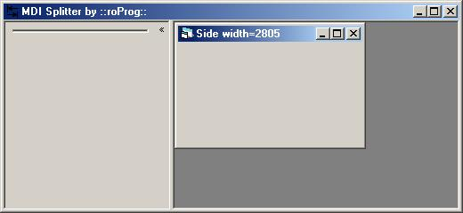



## A\*Super Easy MDI Splitter

### Description

This has got to be the easiest way to have a splitter on an MDI form. See ScreenShot. Please leave comments and/or vote.
 
### More Info
 

             |
---                |---
**Submitted On**   |2001-12-19 20:48:12
**By**             |[Ryan Olson \- OLSONAMI](https://github.com/Planet-Source-Code/PSCIndex/blob/master/ByAuthor/ryan-olson-olsonami.md)
**Level**          |Beginner
**User Rating**    |4.7 (42 globes from 9 users)
**Compatibility**  |VB 5\.0, VB 6\.0
**Category**       |[Miscellaneous](https://github.com/Planet-Source-Code/PSCIndex/blob/master/ByCategory/miscellaneous__1-1.md)
**World**          |[Visual Basic](https://github.com/Planet-Source-Code/PSCIndex/blob/master/ByWorld/visual-basic.md)
**Archive File**   |[A\_Super\_Ea4311712192001\.zip](https://github.com/Planet-Source-Code/ryan-olson-olsonami-a-super-easy-mdi-splitter__1-29963/archive/master.zip)

